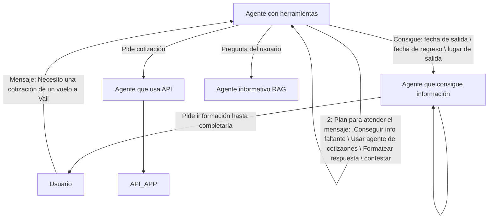

```mermaid
flowchart TD;
    4[Usuario]
    1[Agente con herramientas]
    2[Agente que usa API]
    3[Agente que consigue información]
    5[Agente informativo RAG]
    4-->|Mensaje: Necesito una cotización de un vuelo a Vail|1;
    1-->|1: Reflexiona|1;
    1-->|2: Plan para atender el mensaje: .Conseguir info faltante \ Usar agente de cotizaones \ Formatear respuesta \ contestar|1;
    1-->|Consigue: fecha de salida \ fecha de regreso \ lugar de salida|3;
    3-->|Pide información hasta completarla|4;
    1-->|Pide cotización|2;
    2-->API_APP;
    1-->|Pregunta del usuario|5;
    3-->3;
```