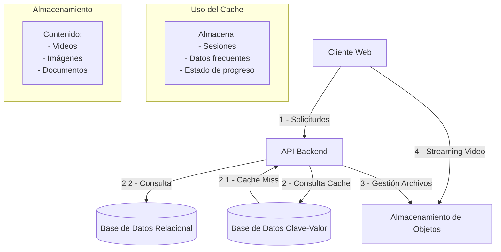

```mermaid

graph TD
    %% Frontend
    Client[Cliente Web]

    %% Backend y servicios
    API[API Backend]
    DB[(Base de Datos Relacional)]
    Cache[(Base de Datos Clave-Valor)]
    Storage[Almacenamiento de Objetos]

    %% Flujo de datos principal
    Client -->|1 - Solicitudes| API
    Client -->|4 - Streaming Video| Storage

    %% Interacciones del backend
    API -->|2 - Consulta Cache| Cache
    Cache -->|2.1 - Cache Miss| API
    API -->|2.2 - Consulta| DB
    API -->|3 - Gestión Archivos| Storage

    %% Notas sobre el uso
    subgraph "Uso del Cache"
        CacheUsos[Almacena:<br>- Sesiones<br>- Datos frecuentes<br>- Estado de progreso]
    end
    subgraph "Almacenamiento"
        StorageUsos[Contenido:<br>- Videos<br>- Imágenes<br>- Documentos]
    end
```

